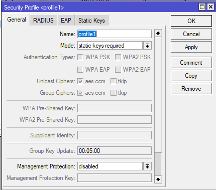
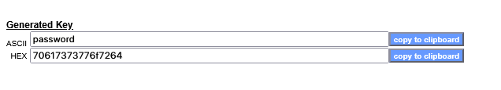
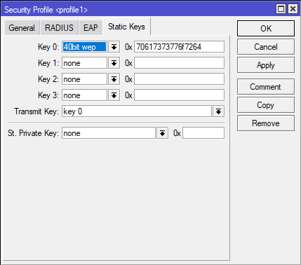
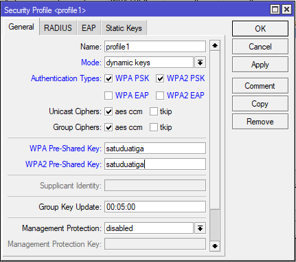
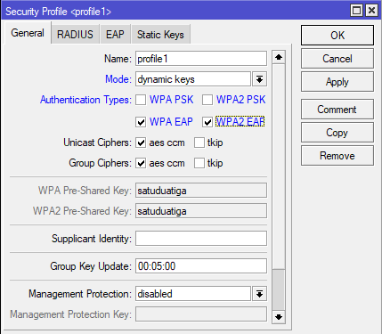
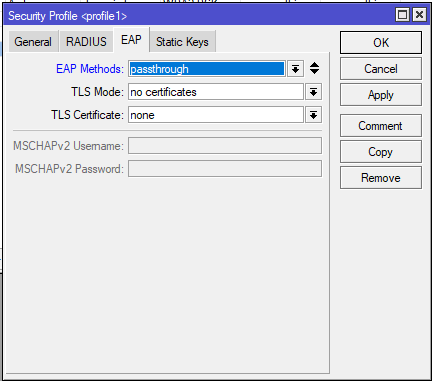
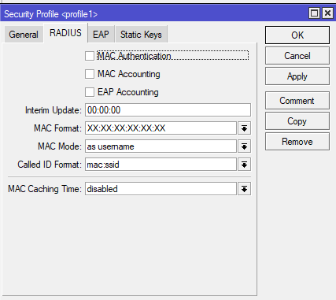

# LAB-39-Wireless-Security
Jum'at 22 Agustus 2025  
  
# Wireless Security
  Ada dua jenis security yang biasa diimplementasikan dalam jaringan wireless, WEP & WPA. Kedua security ini merupakan wireless security yang berbeda generasi yang pastinya banyak perbedaan dan tingkat keamanan.  
**WEP (Wired Equivalent Privacy)**  
  Versi awal security wireless adalah WEP yang diperkenalkan pada September 1999. Bekerja mengunakan stream cipher untuk menjaga kerahasiaan data dan menggunakan CRC-32 checksum untuk memastikan keutuhan data pada saat terjadi transmisi data.  
    WEP juga mengunakan sebuah key. Keys terdiri dari 40 hingga 128 bits yang biasanya didefinisikan secara statik di perangkat AP dan Client sehingga bisa saling berkomunikasi.  
    Saat ini WEP sudah tidak banyak digunakan disebabkan karna WEB rentan terhadap serangan dan sudah dapat dilakukan cracking.  
**WPA (Wi-Fi Protected Access**  
    WPA merupakan generasi lanjutan dari WEP. Dikembangkan karna kerentanan WEP security terhadap serangan. Untuk algoritma enskripsi WPA mengunakan Temporal Key Integrity Protocol (TKIP) atau bisa juga menggunakan Advanced Encryption Standard (AES) dengan kemampuan encryipt lebih tinggi.  
    Pengembangan dari WPA adalah WPA2 yang dalam proses enskripsinya bisa menggunakan kombinasi TKIP dan AES. Dalam hal authentikasi, WPA/WPA2 dapat menerapkan,  
    1. Pre-Shared-Key, WPA-PSK / WPA2-PSK (WPA Personal)  
    2. EAP, WPA-EAP / WPA2-EAP  
    3. RADIUS Server, dengan mode WPA-EAP dapat diterapkkan authentikasi terpusat pada RADIUS server (WPA Enterprise)  

# Mikrotik Wireless Security
  Kita bisa set keamanan wireless di **wireless > security profiles** dan add untuk membuat yang baru.  
  1. None
       Tidak mengunakan enskripsi apa-apa, dan jika ada frame yang telah dienkripsi maka tidak diterima.
  2. Static keys-required
       Digunakan pada mode WEP. Router tidak menerima dan mengirim frame yang tidak dienkripsi. Jika mode inii ditetapkan pada sisi station, maka hanya bisa terkoneksi ke AP dengan mode yang sama.
  3. Static-keys-optional
        Berjalan di WEP mode. Support encription dan decryption, akan tetapi mengijinkan perangkat wireless untuk menerima dan mengirim frames yang tidak dienskripsi. Perangkat akan mengirimkan frames yang tidak dienskripsi jika algoritma enskripsi diset none. Wireless station yang menggunakan ke AP yang menggunakan mode static keys required.
  4. Dynamic Keys
        Mode autentikasi EAP (Extensible Authentication Protocol) yang disupport oleh Mikrotik adalah EAP-TLS, dimana proses autentikasi dilakukan dengan mengunakan CA Certificate.  Mode PSK (Pre Shared Key), dukungan keamanan dari enskripsi WPA/WPA2 dan cara setting yang mudah.
  
# Konfigurasi Wireless Security
**WEP Static Keys**  
  1. Masuk ke tab security profiles di menu wireless, lalu add atau edit yang sudah ada.
  
  2. Dalam penggunaan WEP kita harus melakukan set WEP-Key terlebih dahulu, melakukan convert sebuah kata ke dalam bentuk bilangan hexadecimal pada layanan WEP Key Generator yang banyak terdapat di internet.  
  
  3. Setelah itu masukan ke kolom **0x**  

  
**WPA/WPA2 PSK**  
  1. Masuk ke tab security profiles di menu wireless, lalu add atau edit yang sudah ada.  
  
  2. Pilih Dynamuic keys lalu checklist WPA/WPA1 PSK, setelah itu masukan password dibagian **WPA/2 Pre-Shared Key**.

**WPA/WPA2 EAP**  
  1. Masuk ke tab security profiles di menu wireless, lalu add atau edit yang sudah ada.  
  
  2. Pilih dynamic keys dan checklist WPA/2 EAP.  
  
  3. Kita bisa tentukan bagaimana mode WPA EAP ini bekerja. Pindah ke tab **EAP**.  

  
*EAP METHODS*  
1. EAP-TLS, menggunakan autentikasi EAP-TLS built-in pada perangkat. Sisi AP dan Client harus mengunakan certificate yang sesuai.  
2. Passthrough, AP akan me relay autentikasi ke Radius Server. Tidak ada efeknya jika ditetapkan pada sisi perangkat Client.  
*TLS Mode*  
1. verify certificate, melakukan verifikasi sertifikat. Perangkat yang terkoneksi harus memiliki sertifikat yang valid.
2. dont verify certificate, tidak akan melakukan verifikasi sertifikat remote device.
3. no certificates, tidak memerlukan sertifikat untuk bisa terkoneksi.

**RADIUS MAC Authentication**  
  Selain metode-metodr di atas, kita juga bisa menerapkan autentikasi berdasarkan MAC Address dari Client yang akan terkoneksi.  
  

# Kesimpulan
  Untuk saat ini, wireless security terbaik adalah WPA/WPA2, dimana enskripsi yang digunakan sudah mendukung keutuhan dan kerahasiaan data lebih tinggi. Untuk configurasi WEP agak ribet karna memerlukan generator ataupun hapal agar bisa menerjemahkan phrase kedalam bentuk bilangan hex.  

# Sumber
Citraweb - https://citraweb.com/artikel/93/
